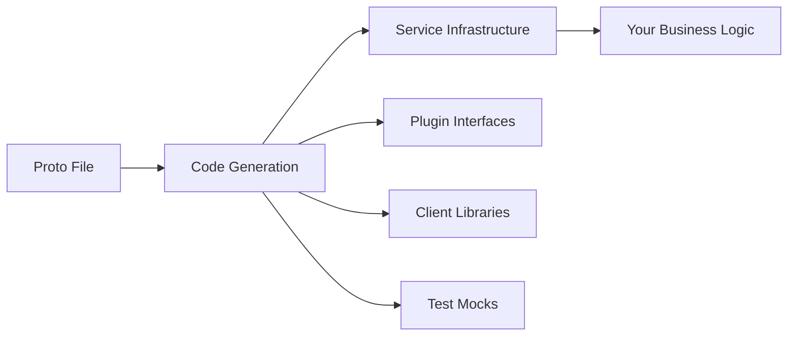
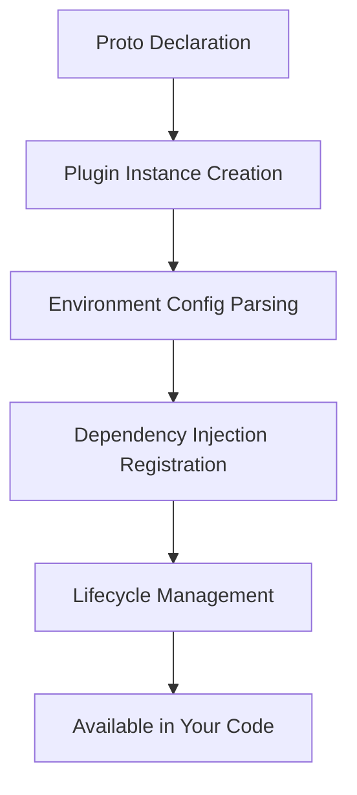

# LastBackend Toolkit Usage Guide for AI Agents

This guide provides specific patterns and examples for AI agents to understand and use the LastBackend Toolkit effectively.

## Framework Understanding

### Core Concept: Proto-First Development
Everything starts with a `.proto` file. The toolkit generates all the infrastructure code, leaving you to focus only on business logic.



### Plugin System Architecture
Plugins handle all external service integrations automatically:



## Step-by-Step Project Generation

### 1. Analyze Requirements
Before generating code, determine:
- **Service type**: API, CRUD, Event-driven, Gateway, Real-time
- **Required plugins**: Database, Cache, Message Queue, Monitoring
- **Server types**: gRPC only, HTTP only, or Multi-protocol
- **External services**: Other services this will communicate with

### 2. Create Proto File Structure
```protobuf
syntax = "proto3";
package {service_package};

option go_package = "{go_package}/gen;servicepb";

// Required imports
import "github.com/lastbackend/toolkit/protoc-gen-toolkit/toolkit/options/annotations.proto";
import "google/api/annotations.proto";
import "validate/validate.proto";

// Plugin declarations (file-level)
option (toolkit.plugins) = {
  prefix: "{descriptive_prefix}"
  plugin: "{plugin_type}"
};

// External service clients (if needed)
option (toolkit.services) = {
  service: "{service_name}",
  package: "{go_package}/gen/client"
};

// Test mock generation
option (toolkit.tests_spec) = {
  mockery: {
    package: "{go_package}/gen/tests"
  }
};

// Service definition
service {ServiceName} {
  option (toolkit.runtime) = {
    servers: [{server_types}]
  };
  
  // Methods with HTTP mappings
  rpc {MethodName}({RequestType}) returns ({ResponseType}) {
    option (google.api.http) = {
      {http_method}: "{http_path}"
      {body_spec}
    };
  };
}

// Message definitions with validation
message {MessageName} {
  {field_type} {field_name} = {field_number} [(validate.rules).{validation_rule}];
}
```

### 3. Generate Project Structure
```bash
# Create directories
mkdir -p {project_name}/{apis,config,internal/{server,repository,controller,service},scripts,tests}

# Create generation script
cat > {project_name}/scripts/generate.sh << 'EOF'
#!/bin/bash -e
# ... generation script content
EOF

# Create go.mod
cat > {project_name}/go.mod << 'EOF'
module {go_package}
go 1.21
# ... dependencies
EOF
```

### 4. Create Main Application
```go
package main

import (
    "context"
    "os"
    
    "{go_package}/config"
    servicepb "{go_package}/gen"
    "{go_package}/internal/server"
    "{go_package}/internal/repository"
    "{go_package}/internal/controller"
    "github.com/lastbackend/toolkit/pkg/runtime"
)

func main() {
    app, err := servicepb.New{ServiceName}Service("{service_name}",
        runtime.WithVersion("{version}"),
        runtime.WithDescription("{description}"),
        runtime.WithEnvPrefix("{ENV_PREFIX}"),
    )
    if err != nil {
        panic(err)
    }

    // Application configuration
    cfg := config.New()
    if err := app.RegisterConfig(cfg); err != nil {
        app.Log().Error(err)
        return
    }

    // Register packages (dependency injection)
    app.RegisterPackage(repository.NewRepository, controller.NewController)

    // Configure servers
    app.Server().GRPC().SetService(server.New{ServiceName}Server)
    
    // Optional: HTTP middleware
    // app.Server().HTTP().SetMiddleware(server.New{ServiceName}HTTPMiddleware)

    if err := app.Start(context.Background()); err != nil {
        app.Log().Errorf("failed to start service: %v", err)
        os.Exit(1)
    }
}
```

## Common Service Patterns

### 1. CRUD Microservice
**Use when**: Standard data operations with REST API

**Plugins needed**:
```protobuf
option (toolkit.plugins) = {
  prefix: "pgsql"
  plugin: "postgres_gorm"
};

option (toolkit.plugins) = {
  prefix: "cache"
  plugin: "redis"
};
```

**Service definition**:
```protobuf
service {EntityName}Service {
  option (toolkit.runtime) = {
    servers: [GRPC, HTTP]
  };
  
  rpc Create{EntityName}(Create{EntityName}Request) returns (Create{EntityName}Response) {
    option (google.api.http) = { post: "/{entities}" body: "*" };
  };
  
  rpc Get{EntityName}(Get{EntityName}Request) returns (Get{EntityName}Response) {
    option (google.api.http) = { get: "/{entities}/{entity_id}" };
  };
  
  rpc Update{EntityName}(Update{EntityName}Request) returns (Update{EntityName}Response) {
    option (google.api.http) = { put: "/{entities}/{entity_id}" body: "*" };
  };
  
  rpc Delete{EntityName}(Delete{EntityName}Request) returns (Delete{EntityName}Response) {
    option (google.api.http) = { delete: "/{entities}/{entity_id}" };
  };
  
  rpc List{EntityName}s(List{EntityName}sRequest) returns (List{EntityName}sResponse) {
    option (google.api.http) = { get: "/{entities}" };
  };
}
```

### 2. Event-Driven Service
**Use when**: Publishing/subscribing to events, background processing

**Plugins needed**:
```protobuf
option (toolkit.plugins) = {
  prefix: "pgsql"
  plugin: "postgres_gorm"
};

option (toolkit.plugins) = {
  prefix: "queue"
  plugin: "rabbitmq"
};
```

**Service definition**:
```protobuf
service EventService {
  option (toolkit.runtime) = {
    servers: [GRPC, HTTP]
  };
  
  rpc PublishEvent(PublishEventRequest) returns (PublishEventResponse) {
    option (google.api.http) = { post: "/events" body: "*" };
  };
  
  rpc GetEventHistory(GetEventHistoryRequest) returns (GetEventHistoryResponse) {
    option (google.api.http) = { get: "/events" };
  };
}
```

### 3. Real-time Service
**Use when**: WebSocket connections, live updates, chat systems

**Plugins needed**:
```protobuf
option (toolkit.plugins) = {
  prefix: "pgsql"
  plugin: "postgres_gorm"
};

option (toolkit.plugins) = {
  prefix: "realtime"
  plugin: "centrifuge"
};
```

**Service definition**:
```protobuf
service RealtimeService {
  option (toolkit.runtime) = {
    servers: [GRPC, HTTP, WEBSOCKET]
  };
  
  rpc Subscribe(SubscribeRequest) returns (SubscribeResponse) {
    option (toolkit.route).websocket = true;
    option (google.api.http) = { get: "/subscribe" };
  };
  
  rpc Broadcast(BroadcastRequest) returns (BroadcastResponse) {
    option (google.api.http) = { post: "/broadcast" body: "*" };
  };
}
```

### 4. API Gateway
**Use when**: Routing requests to multiple backend services

**Plugins needed**: Usually none (pure proxy)

**Service definition**:
```protobuf
service ApiGateway {
  option (toolkit.runtime) = {
    servers: [HTTP, WEBSOCKET_PROXY]
  };
  
  rpc ProxyToUserService(userservice.GetUserRequest) returns (userservice.GetUserResponse) {
    option (toolkit.route) = {
      http_proxy: {
        service: "user-service"
        method: "/userservice.UserService/GetUser"
      }
    };
    option (google.api.http) = { get: "/api/v1/users/{user_id}" };
  };
}
```

### 5. Background Worker
**Use when**: Processing queued jobs, scheduled tasks

**Plugins needed**:
```protobuf
option (toolkit.plugins) = {
  prefix: "pgsql"
  plugin: "postgres_gorm"
};

option (toolkit.plugins) = {
  prefix: "queue"
  plugin: "rabbitmq"
};
```

**Service definition**:
```protobuf
service WorkerService {
  option (toolkit.runtime) = {
    servers: [GRPC]  // Internal service, no HTTP
  };
  
  rpc ProcessJob(ProcessJobRequest) returns (ProcessJobResponse);
  rpc GetJobStatus(GetJobStatusRequest) returns (GetJobStatusResponse);
}
```

## Plugin Configuration Examples

### PostgreSQL Plugin
```bash
# Environment variables (auto-parsed by plugin)
{ENV_PREFIX}_PGSQL_HOST=localhost
{ENV_PREFIX}_PGSQL_PORT=5432
{ENV_PREFIX}_PGSQL_USERNAME=user
{ENV_PREFIX}_PGSQL_PASSWORD=secret
{ENV_PREFIX}_PGSQL_DATABASE=myapp
{ENV_PREFIX}_PGSQL_SSL_MODE=disable
{ENV_PREFIX}_PGSQL_TIMEZONE=UTC
{ENV_PREFIX}_PGSQL_DEBUG=false
{ENV_PREFIX}_PGSQL_MIGRATIONS_DIR=./migrations
```

### Redis Plugin
```bash
{ENV_PREFIX}_CACHE_HOST=localhost
{ENV_PREFIX}_CACHE_PORT=6379
{ENV_PREFIX}_CACHE_PASSWORD=redispass
{ENV_PREFIX}_CACHE_DATABASE=0
{ENV_PREFIX}_CACHE_POOL_SIZE=10
{ENV_PREFIX}_CACHE_DIAL_TIMEOUT=5
{ENV_PREFIX}_CACHE_READ_TIMEOUT=3
{ENV_PREFIX}_CACHE_WRITE_TIMEOUT=3
```

### RabbitMQ Plugin
```bash
{ENV_PREFIX}_QUEUE_HOST=localhost
{ENV_PREFIX}_QUEUE_PORT=5672
{ENV_PREFIX}_QUEUE_USERNAME=guest
{ENV_PREFIX}_QUEUE_PASSWORD=guest
{ENV_PREFIX}_QUEUE_VHOST=/
{ENV_PREFIX}_QUEUE_PREFETCH=1
```

## Implementation Patterns

### Repository Layer (Data Access)
```go
type Repository struct {
    db  servicepb.PgsqlPlugin
    log toolkit.Logger
}

func NewRepository(app toolkit.Service, db servicepb.PgsqlPlugin) *Repository {
    return &Repository{
        db:  db,
        log: app.Log(),
    }
}

func (r *Repository) Create{Entity}(ctx context.Context, entity *{Entity}) error {
    return r.db.DB().WithContext(ctx).Create(entity).Error
}

func (r *Repository) Get{Entity}(ctx context.Context, id string) (*{Entity}, error) {
    var entity {Entity}
    err := r.db.DB().WithContext(ctx).Where("id = ?", id).First(&entity).Error
    return &entity, err
}

func (r *Repository) Update{Entity}(ctx context.Context, entity *{Entity}) error {
    return r.db.DB().WithContext(ctx).Save(entity).Error
}

func (r *Repository) Delete{Entity}(ctx context.Context, id string) error {
    return r.db.DB().WithContext(ctx).Delete(&{Entity}{}, "id = ?", id).Error
}

func (r *Repository) List{Entity}s(ctx context.Context, limit, offset int) ([]*{Entity}, error) {
    var entities []*{Entity}
    err := r.db.DB().WithContext(ctx).Limit(limit).Offset(offset).Find(&entities).Error
    return entities, err
}
```

### Service Layer (Business Logic)
```go
type Service struct {
    repo  *repository.Repository
    cache servicepb.CachePlugin
    queue servicepb.QueuePlugin
    log   toolkit.Logger
}

func NewService(
    app toolkit.Service,
    repo *repository.Repository,
    cache servicepb.CachePlugin,
    queue servicepb.QueuePlugin,
) *Service {
    return &Service{
        repo:  repo,
        cache: cache,
        queue: queue,
        log:   app.Log(),
    }
}

func (s *Service) Create{Entity}(ctx context.Context, req *Create{Entity}Request) (*{Entity}, error) {
    entity := &{Entity}{
        Name:  req.Name,
        Email: req.Email,
        // ... other fields
    }
    
    // Save to database
    if err := s.repo.Create{Entity}(ctx, entity); err != nil {
        return nil, fmt.Errorf("failed to create {entity}: %w", err)
    }
    
    // Cache the entity (best effort)
    if data, err := json.Marshal(entity); err == nil {
        s.cache.Client().Set(ctx, fmt.Sprintf("{entity}:%s", entity.ID), data, time.Hour)
    }
    
    // Publish event (best effort)
    if eventData, err := json.Marshal(map[string]interface{}{
        "type": "{entity}_created",
        "{entity}_id": entity.ID,
        "timestamp": time.Now(),
    }); err == nil {
        s.queue.Publish("{entity}.created", eventData)
    }
    
    return entity, nil
}

func (s *Service) Get{Entity}(ctx context.Context, id string) (*{Entity}, error) {
    // Try cache first
    if cached, err := s.cache.Client().Get(ctx, fmt.Sprintf("{entity}:%s", id)).Result(); err == nil {
        var entity {Entity}
        if err := json.Unmarshal([]byte(cached), &entity); err == nil {
            return &entity, nil
        }
    }
    
    // Fallback to database
    entity, err := s.repo.Get{Entity}(ctx, id)
    if err != nil {
        return nil, fmt.Errorf("failed to get {entity}: %w", err)
    }
    
    // Update cache
    if data, err := json.Marshal(entity); err == nil {
        s.cache.Client().Set(ctx, fmt.Sprintf("{entity}:%s", id), data, time.Hour)
    }
    
    return entity, nil
}
```

### Server Layer (gRPC Handlers)
```go
type {ServiceName}Server struct {
    servicepb.{ServiceName}RpcServer
    
    app     toolkit.Service
    service *service.Service
}

func New{ServiceName}Server(
    app toolkit.Service,
    service *service.Service,
) servicepb.{ServiceName}RpcServer {
    return &{ServiceName}Server{
        app:     app,
        service: service,
    }
}

func (s *{ServiceName}Server) Create{Entity}(ctx context.Context, req *Create{Entity}Request) (*Create{Entity}Response, error) {
    // Input validation
    if err := req.Validate(); err != nil {
        return nil, status.Error(codes.InvalidArgument, err.Error())
    }
    
    entity, err := s.service.Create{Entity}(ctx, req)
    if err != nil {
        s.app.Log().WithError(err).Error("failed to create {entity}")
        return nil, status.Error(codes.Internal, "failed to create {entity}")
    }
    
    return &Create{Entity}Response{
        {Entity}Id: entity.ID,
        Status:     "created",
    }, nil
}

func (s *{ServiceName}Server) Get{Entity}(ctx context.Context, req *Get{Entity}Request) (*Get{Entity}Response, error) {
    if err := req.Validate(); err != nil {
        return nil, status.Error(codes.InvalidArgument, err.Error())
    }
    
    entity, err := s.service.Get{Entity}(ctx, req.{Entity}Id)
    if err != nil {
        if errors.Is(err, repository.ErrNotFound) {
            return nil, status.Error(codes.NotFound, "{entity} not found")
        }
        s.app.Log().WithError(err).Error("failed to get {entity}")
        return nil, status.Error(codes.Internal, "failed to get {entity}")
    }
    
    return &Get{Entity}Response{
        {Entity}Id:  entity.ID,
        Name:        entity.Name,
        Email:       entity.Email,
        CreatedAt:   timestamppb.New(entity.CreatedAt),
        UpdatedAt:   timestamppb.New(entity.UpdatedAt),
    }, nil
}
```

## Message Validation Patterns

### Common Validation Rules
```protobuf
message CreateUserRequest {
  string name = 1 [
    (validate.rules).string.min_len = 1,
    (validate.rules).string.max_len = 100
  ];
  
  string email = 2 [
    (validate.rules).string.pattern = "^[^@]+@[^@]+\\.[^@]+$"
  ];
  
  int32 age = 3 [
    (validate.rules).int32.gte = 0,
    (validate.rules).int32.lte = 150
  ];
  
  repeated string tags = 4 [
    (validate.rules).repeated.max_items = 10
  ];
  
  google.protobuf.Timestamp birth_date = 5 [
    (validate.rules).timestamp.lt_now = true
  ];
}

message UpdateUserRequest {
  string user_id = 1 [
    (validate.rules).string.uuid = true
  ];
  
  string name = 2 [
    (validate.rules).string.min_len = 1,
    (validate.rules).string.max_len = 100
  ];
  
  optional string email = 3 [
    (validate.rules).string.pattern = "^[^@]+@[^@]+\\.[^@]+$"
  ];
}
```

## Error Handling Patterns

### Service Level Errors
```go
var (
    ErrNotFound      = errors.New("not found")
    ErrAlreadyExists = errors.New("already exists")
    ErrInvalidInput  = errors.New("invalid input")
)

func (s *Service) Create{Entity}(ctx context.Context, req *Create{Entity}Request) (*{Entity}, error) {
    // Check if already exists
    if existing, _ := s.repo.GetByEmail(ctx, req.Email); existing != nil {
        return nil, fmt.Errorf("user with email %s: %w", req.Email, ErrAlreadyExists)
    }
    
    entity := &{Entity}{
        Name:  req.Name,
        Email: req.Email,
    }
    
    if err := s.repo.Create{Entity}(ctx, entity); err != nil {
        return nil, fmt.Errorf("failed to create {entity}: %w", err)
    }
    
    return entity, nil
}
```

### gRPC Error Mapping
```go
func (s *Server) handleError(err error) error {
    switch {
    case errors.Is(err, service.ErrNotFound):
        return status.Error(codes.NotFound, "resource not found")
    case errors.Is(err, service.ErrAlreadyExists):
        return status.Error(codes.AlreadyExists, "resource already exists")
    case errors.Is(err, service.ErrInvalidInput):
        return status.Error(codes.InvalidArgument, err.Error())
    default:
        return status.Error(codes.Internal, "internal server error")
    }
}
```

## Testing Patterns

### Unit Tests
```go
func TestService_Create{Entity}(t *testing.T) {
    // Setup
    mockRepo := new(tests.MockRepository)
    mockCache := new(tests.MockCachePlugin)
    mockQueue := new(tests.MockQueuePlugin)
    
    service := NewService(nil, mockRepo, mockCache, mockQueue)
    
    // Test data
    req := &Create{Entity}Request{
        Name:  "John Doe",
        Email: "john@example.com",
    }
    
    expected{Entity} := &{Entity}{
        ID:    "123",
        Name:  "John Doe",
        Email: "john@example.com",
    }
    
    // Mock expectations
    mockRepo.On("Create{Entity}", mock.Anything, mock.MatchedBy(func(e *{Entity}) bool {
        return e.Name == "John Doe" && e.Email == "john@example.com"
    })).Return(nil).Run(func(args mock.Arguments) {
        entity := args.Get(1).(*{Entity})
        entity.ID = "123"
    })
    
    mockCache.On("Client").Return(&tests.MockRedisClient{})
    mockQueue.On("Publish", "{entity}.created", mock.Anything).Return(nil)
    
    // Execute
    result, err := service.Create{Entity}(context.Background(), req)
    
    // Assert
    assert.NoError(t, err)
    assert.Equal(t, expected{Entity}.ID, result.ID)
    assert.Equal(t, expected{Entity}.Name, result.Name)
    assert.Equal(t, expected{Entity}.Email, result.Email)
    
    mockRepo.AssertExpectations(t)
}
```

This guide provides the essential patterns and examples needed for AI agents to generate consistent, well-structured LastBackend Toolkit projects.